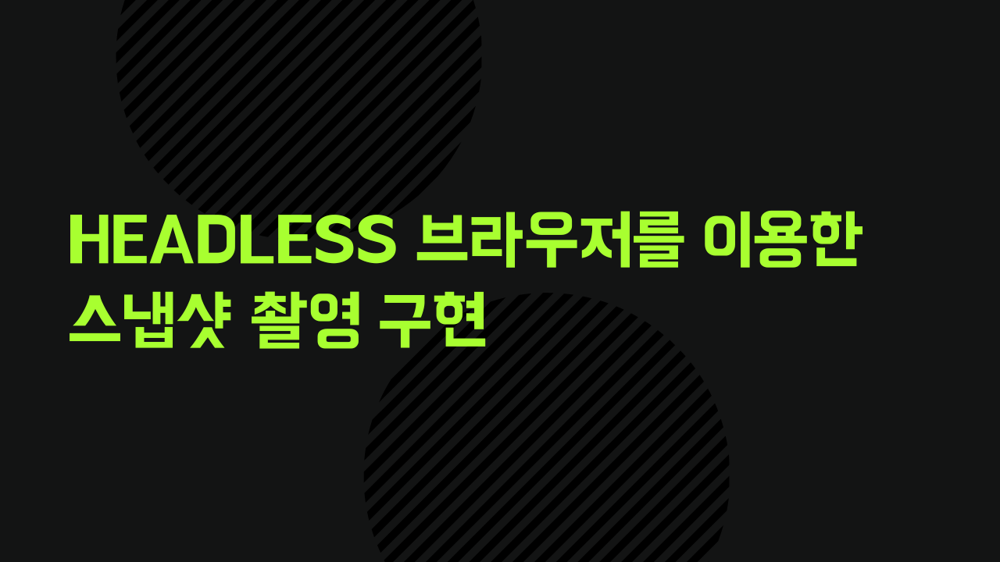
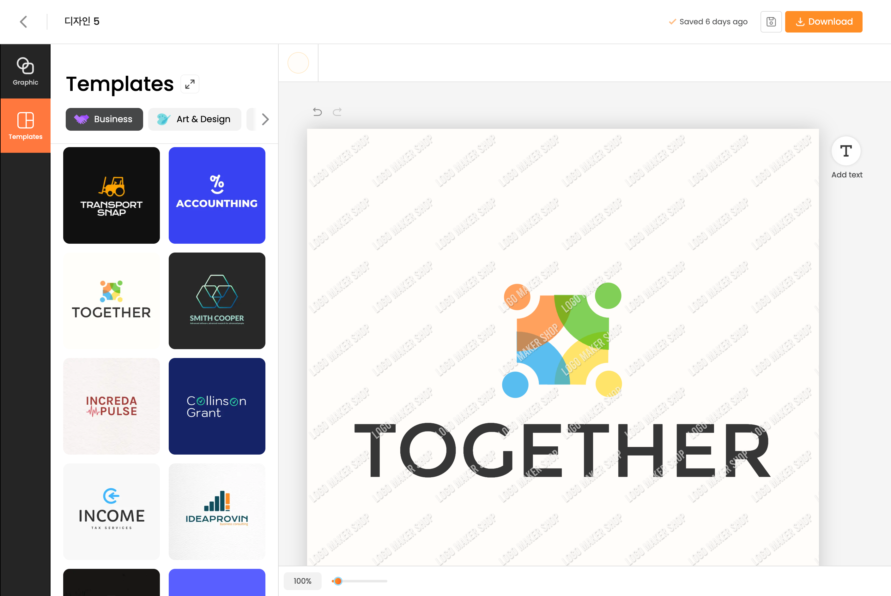
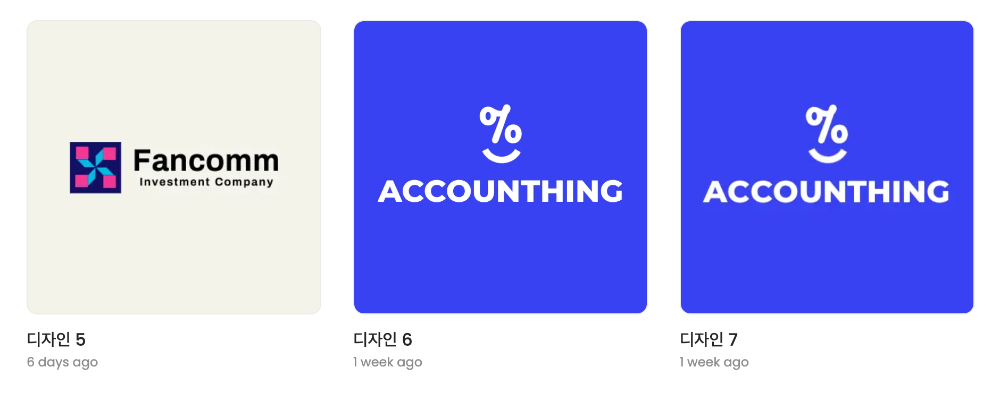

## 들어가며
요즘 업무가 바빠 기술 블로그에 글을 투고 한지 너무 오래 되었다는 것도 잊고 있었습니다.  
1년 전 부터 준비하던 서비스가 런칭을 목전에 두고 있기에 굉장히 설레는 요즘을 보내고 있거든요!
## 요즘 개발하는 서비스란?
  
짜잔! 이처럼 정말 예쁘고 강력한 디자인 서비스를 개발하고 있었습니다.  
이 서비스에서 가장 강력한 기능이자, 제가 가장 많은 공을 들린 기능은 바로 디자인 편집 툴입니다.  
디자인 편집을 가능하게 해주는 이 에디터는 브라우저의 DOM을 이용하는데요, 에디터를 어떻게 만들었는지에 대해서는 할 얘기가 정말 너무 많지만 오늘은 이 얘기에 대해서 조금 접어두고 다른 얘기를 하고자 해요.

## DOM 렌더링 엔진의 한계
위에서 말씀 드렸다시피 이 에디터는 DOM으로 설계 되어 동작하고 있어요.  

  
그렇다보니 이와 같이 사용자가 작업한 디자인을 미리 보여주는 스냅샷을 촬영하는게 하나의 난제로 다가오게 되었어요.  
왜냐면 일반적인 방법으로는 DOM에 그려진 요소들을 레스터 이미지로 만드는 방법이 존재하지 않았고, [html2canvas](https://html2canvas.hertzen.com/)와 같은 라이브러리는 렌더링 된 화면을 온전히 그려내지 못했거든요.
이런 기능은 비단 Snapshot 뿐 아니라 유저가 제작한 디자인을 다운로드 받게 하는 **핵심 기능에도 관여하기 때문에 반드시 해결해야만 하는 문제였어요.**

그러다가 생각해 낸 하나의 묘수가 바로 Headless 브라우저를 이용한 스냅샷 촬영이었어요.  
촬영 플로우는 다음과 같아요.
1. Headless 브라우저를 이용하여 렌더링 엔진을 활성화 한다.
2. 렌더링 엔진에서 사용자가 편집한 디자인을 그려낸다.
3. 렌더링 엔진 자체를 Headless 브라우저의 `screenshot` 메소드를 사용하여 촬영한다.
4. base64로 반환한다.

자, 정말 완벽한 계획이죠?

다만 이 플랜에는 한가지 단점이 있었어요.  
**렌더링 엔진을 호스팅하는 서비스에 접근하여 그려내야 한다**는 점이에요.

일단 브라우저를 켜고, 렌더링 엔진 호스팅 서비스에 접근하는 행위 자체가 다소 시간이 걸린다는 점이 문제였어요.  
이 과정에서 병목을 최대한 줄이기 위해 가장 유명한 브라우저인 Puppeteer 대신 Playwright 브라우저를 채택하자고 아이디어를 낸 백엔드 개발팀 덕분에 브라우저 인스턴스에 대한 로딩 속도는 어느정도 해결 했지만 네트워크 접속 시간에 대해서는 어떻게 하기가 어렵더라구요.  
그래서 제가 생각해낸 아이디어는 '**한번 호출한 리소스는 최대한 빼먹어보자**'였어요.

기존 스냅샷 촬영 플로우는 다음과 같아요.

{: width="300" }
위 과정을 살펴보면 페이지 접속 혹은 렌더링에 필요한 외부 리소스를 다운로드 받는 과정들이 다수 포함 되어 있는 것을 알 수 있습니다.  
이로 인해 [작업물 추출] 기능에 가장 큰 성능 저하를 야기하는 부분은 네트워크 관련 부분임을 가늠할 수 있어요.
## 해결 방법
원인을 예상했다면 이제 어떤 부분을 바꿔 볼 수 있을까요?
### 자원의 재사용
우선 위에 작성한 절차를 밟아보면 페이지를 접속한 이후 렌더링까지 꽤 많은 시간을 소모함을 알 수 있습니다.

- 페이지 인스턴스의 생성
- 렌더링 엔진 페이지 열기
- 렌더링에 필요한 리소스 다운로드
- 브라우저의 렌더링 완료 대기

이렇게 많은 자원을 소모하는 렌더링 프로세스를 각기 다른 해상도의 캡처를 위해 **세 번이나 반복합니다.**

소스코드를 보면서 얘기 해볼까요?

```typescript
const promises = snapshotScales.map(async (scale) => {
    const newPage = await browser.newPage(); // 새로운 페이지 인스턴스 생성
    await newPage.goto(`${host}/renderer?designId=${designId}&scale=${scale}`, { waitUntil: 'domcontentloaded' });
    await newPage.waitForSelector('.RendererScreen__Zoom');
    await newPage.waitForSelector('.TemplateRendererLayer');
    await newPage.waitForTimeout(500); // 단순 대기

    const jpgScreenshot = await newPage.locator('.TemplateRendererLayer').screenshot({ type: 'jpeg' });
    const pngScreenshot = await newPage.locator('.TemplateRendererLayer').screenshot({ type: 'png' });

    await newPage.close(); // 페이지 인스턴스 닫기

    snapshots.jpg.push(jpgScreenshot.toString('base64'));
    snapshots.png.push(pngScreenshot.toString('base64'));
});

await Promise.all(promises);
```

위 소스코드는 `snapScales`라는 배열에 캡처할 배율을 담아두고 렌더링 엔진에 접근하는 로직을 병렬적으로 수행하고 있습니다.

이럴 경우 `waitForTimeout`으로 인해 확정적으로 500ms가 지연이 되고, 각각의 Element가 로드 되는 것을 기다리는 것 까지 합치면 거의 1초에 육박하는 대기시간을 여러번 대기하게 된다는 것을 알 수 있습니다.

그래서 아래와 같은 순서대로 수정을 진행했습니다.

1. 한번 렌더링 과정까지 마친 페이지 인스턴스는 모든 이미지를 캡처하기 까지 소멸시키지 않는다.
2. 여러 해상도의 이미지는 DOM Element의 `scale`을 직접 조정하여 캡처한다.

이렇게 수정한 코드는 아래와 같습니다.


```typescript
const newPage = await browser.newPage(); // 새로운 페이지 인스턴스 생성
await newPage.goto(`${host}/renderer?designId=${designId}`, { waitUntil: 'domcontentloaded' });
await newPage.waitForSelector('.RendererScreen__Zoom');
await newPage.waitForSelector('.TemplateRendererLayer');
await newPage.waitForTimeout(500); // 단순 대기

const promises = snapshotScales.map(async (scale) => {
		await newPage.evaluate((scale) => {
			const element = document.querySelector('.TemplateRendererLayer');

			element.style.setProperty('transform' `scale(${scale})`);
		}, scale);

    const jpgScreenshot = await newPage.locator('.TemplateRendererLayer').screenshot({ type: 'jpeg' });
    const pngScreenshot = await newPage.locator('.TemplateRendererLayer').screenshot({ type: 'png' });

    await newPage.close(); // 페이지 인스턴스 닫기

    snapshots.jpg.push(jpgScreenshot.toString('base64'));
    snapshots.png.push(pngScreenshot.toString('base64'));
});

await Promise.all(promises);
```

하지만 이렇게 만들고 나니까 새로운 문제를 마주하게 되었습니다.
## 동일한 인스턴스를 이용한 병렬 처리의 문제점
페이지 인스턴스를 초기화 하지 않고 css를 제어하기 때문에 Promise.all을 이용하여 일괄적으로 처리 하고자 하면 연속 된 요청 도중 이전 요청에 대한 css가 남아있기 때문에 최종적인 결과물이 모두 3배율로 뽑히는 문제가 있었습니다.
  
이러한 상황을 해결하려면 순차적으로 이미지 추출을 처리해야 하는데 **순차 처리는 일반적인 비동기 처리 상황에서 병렬 처리보다 느립니다.**  
결국 **네트워크 요청을 최소화 하느냐 vs 순차적으로 처리하느냐의 Trade-Off가 발생**하였고 실제로 얼마나 차이가 나는지를 알아보기 위해 아래와 같이 순차 처리 코드로 변경하고 성능을 측정하였습니다.
```typescript
for await (const scale of snapshotScales) {
  await page
    .evaluate((scale) => {
      const zoomElement = document.querySelector('.RendererScreen__Zoom') as HTMLElement;

      if (zoomElement) {
        zoomElement.style.setProperty('transform', `scale(${scale})`);
      }
    }, scale)
    .then(() => page.waitForTimeout(10))
    .then(() => page.locator('.TemplateRendererLayer').screenshot({ type: 'jpeg' }))
    .then((screenshot) => screenshot.toString('base64'))
    .then((base64) => base64 && snapshots.jpg.push(base64))
    .then(() => page.locator('.TemplateRendererLayer').screenshot({ type: 'png' }))
    .then((screenshot) => screenshot.toString('base64'))
    .then((base64) => base64 && snapshots.png.push(base64));
}
```
## 병렬 처리 vs 순차 처리
위에서 작성한 서버 코드를 사용하기 위해 다음과 같은 코드를 작성하고 실행하여 API 실행 전과 실행 완료 후 시간을 측정하여 그 둘을 서로 뺀 값으로 실행 시간을 측정하였습니다.
```typescript
const start = new Date().getTime(); // 코드 실행 시작 시간

apiClient
  .axios
	.get('http://localhost:3000/api/snapshot', { params: { designId } })
	  .then((r) => r.data)
	  .then(({ snapshots: { jpg, png } }) => {
	    const end = new Date().getTime(); // 코드 실행 종료 시간
	    const gap = end - start; // 종료 시간에서 시작 시간을 뺀 실제 실행 시간
	
	    console.log(gap); // <-- 실행 시간 출력
	    jpg.map((url, key) => {
	      const anchor = document.createElement('a');
	
	      anchor.href = `data:image/jpg;base64,${url}`;
	      anchor.download = `url${key}.jpg`;
	
	      anchor.click();
	      anchor.remove();
	    });
	
	    png.map((url, key) => {
	      const anchor = document.createElement('a');
	
	      anchor.href = `data:image/png;base64,${url}`;
	      anchor.download = `url${key}.png`;
	
	      anchor.click();
	      anchor.remove();
	    });
	  });
```
성능은 아래와 같이 나왔습니다.
  
**3000ms대의 결과가 병렬 처리를 이용한 방식이고, 2000ms 대의 결과가 순차 처리를 이용한 방식입니다.**

비동기 로직을 처리하는 대부분의 Case에서는 순차 처리가 병렬 처리보다 느리다는 것이 일반적이지만 페이지 인스턴스를 재사용하여 네트워크 요청을 최소화 하는 편이 이번과 같은 Case에서는 순차 처리 로직이 더욱 긍정적인 퍼포먼스를 발휘할 수도 있다는 것을 알게 되었습니다.
## 마치며
다만 이와 같은 Case에서는 **무수한 환경적 요인이 작용합니다.**

스크린샷을 촬영하는 컴퓨터와 네트워크의 환경이 위의 테스트 환경보다 좋다면 Content Delivery 속도 또한 증가하여 본 문서와 다른 결과가 나올 수도 있기에 네트워크 속도가 느린 서비스 환경에서 참고한다면 성능 개선을 기대할 수 있겠지만 그렇지 않다면 오히려 성능 저하를 발생시킬 수도 있음을 유의해야 할 것 같습니다.